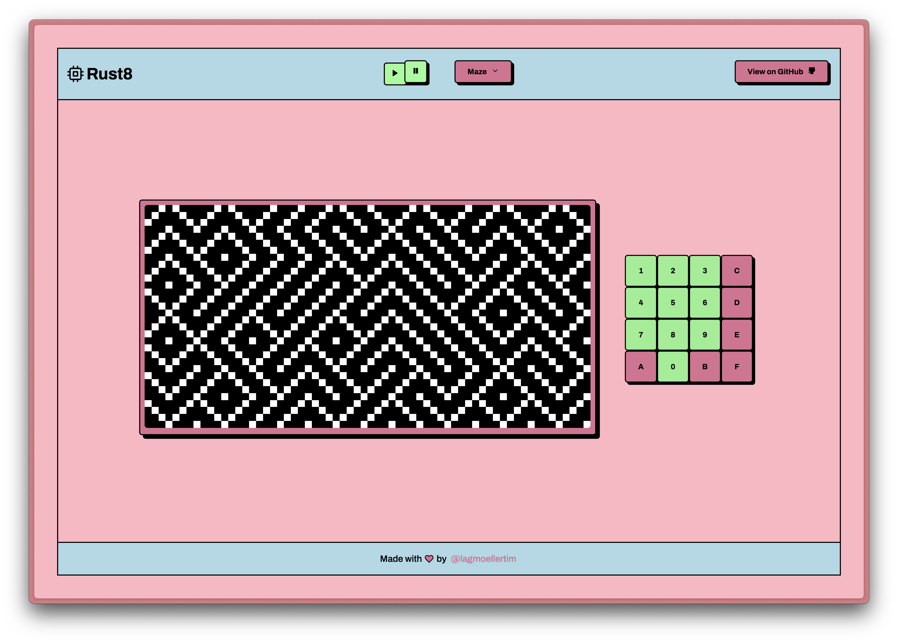

<h1 align="center">Rust8 Web</h1>

*<p align="center">A Chip-8 Emulator for the web</p>*

<p align="center">
  <a href="https://github.com/lagmoellertim/rust8-web/blob/master/LICENSE" target="_blank"></a>
</p>

---



## Introduction

Welcome to **Rust8 Web**, a high-performance online CHIP-8 emulator. This project leverages the power of Rust for the core emulation logic, WebAssembly (WASM) to bring classic CHIP-8 games and applications to the modern web and React to give you a pretty web interface. Rust8 Web is based on [Rust8](https://github.com/lagmoellertim/rust8), a Rust library designed for CHIP-8 emulation. 

## Features

- **High Performance**: Written in Rust, rust8 web offers fast and efficient CHIP-8 emulation.
- **Cross-Platform**: Runs in any modern web browser, making classic CHIP-8 programs accessible on a wide range of devices.
- **Easy to Use**: Simply load a CHIP-8 ROM and start playing.
- **Mobile Friendly**: Responsive design for an enjoyable experience on both desktop and mobile devices.
## Getting Started

To play CHIP-8 games in your browser with rust8 web, follow these steps:

### Prerequisites

- A modern web browser that supports WebAssembly.

### Running Online

Visit the [live version](https://lagmoellertim.github.io/rust8-web/) to start playing immediately. No installation required.

### Running Locally

1. Clone the repository:

```bash
git clone https://github.com/lagmoellertim/rust8-web.git
cd rust8-web
```

2. Install dependencies and build the project

```bash
npm install
npm run build
```

3. Start Rust8 Web

```bash
npm start
```

## How to Use
- **Load a ROM**: Select a provided ROM from the list or upload your own
- **Start Playing**: You can use the onscreen keyboard or your real keyboard for controlling the emulator
- **Pause**: If you want to pause a running game, press the onscreen pause button or hit the space key

## Contributing

If you are missing a feature or have new idea, go for it! That is what open-source is for! 😃

## Author

**Tim-Luca Lagmöller** ([@lagmoellertim](https://github.com/lagmoellertim))

## Donations / Sponsors

I'm part of the official GitHub Sponsors program where you can support me on a monthly basis.

<a href="https://github.com/sponsors/lagmoellertim" target="_blank"></a>

You can also contribute by buying me a coffee (this is a one-time donation).

<a href="https://ko-fi.com/lagmoellertim" target="_blank"></a>

Thank you for your support!

## License

The Code is licensed under the

[MIT License](https://github.com/lagmoellertim/rust8-web/blob/master/LICENSE)

Copyright © 2024-present, [Tim-Luca Lagmöller](https://lagmoellertim.de)

## Have fun :tada:
